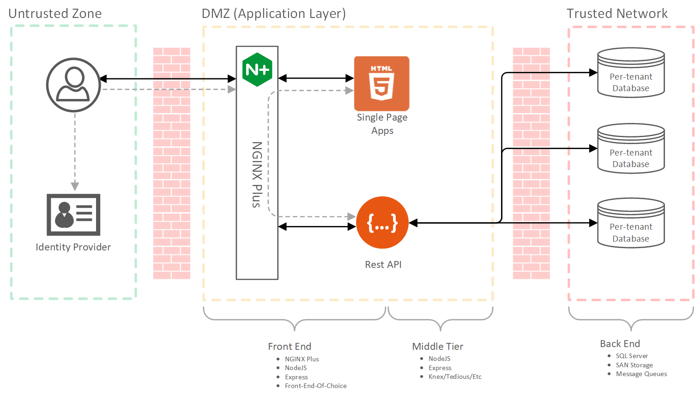

# Landlord Library

Landlord is a library for building multitenant applications on top of [NodeJS](https://nodejs.org/) and [Express](https://expressjs.com/).  It consists of a several utilities that work together to add the following capabilities to Express:

- [Express Landlord](docs/express-landlord.md): Multitenant configuration management and database connectivity
- [Express Module Loader](docs/module-loader.md): Organize code into modules, and avoid creating monoliths
- [Express Route Reporter](docs/route-reporter.md): Transparency into route-based middlewares

## What does "Multitenant" mean?

There are varying definitions of what constitutes a "multitenant" architecture.  In this case, the term refers to a configuration where the database instances for each customer/tenant are physically and logically separated from each other, but the web/service/compute tier is a shared resource.  The following diagram represents this type of architecture.



Note that while the databases are isolated resources, the Front End and Middle Tier are shared by all tenants.

# How does Landlord work?

The Landlord Library is comprised of several modules that work together to provide a simplified development experience when juggling multiple tenants.  What follows is a brief overview of those modules.  [The included example application](./example/) demonstrates how it all fits together if you would rather jump right to the code.

- [Express Landlord](docs/express-landlord.md) simplifies interactions with tenant configuration data and tenant databases in a multitenant environment.  It allows developers to write code as if they were working in a single-tenant environment by automatically managing access to configuration and databases connections as part of the Express request lifecycle. 

- [Express Module Loader](docs/module-loader.md) enables a modular approach to Express development.  It provides a mechanism for loading modules (folders full of code) dynamically at runtime.  This means applications can be composed of many smaller applications instead of having to rely on a single large codebase.  This helps avoid the creation of bloated and untestable monolithic apps by favoring the development of smaller, more cohesive units of code.

- [Express Route Reporter](docs/route-reporter.md) was created to make life a bit easier on the development team and sysadmins.

The library sits on top of NodeJS and Express to provide a simplified way for other code to interact with the multitenant environment.  It allows developers to focus on business logic without spending too much wrangling infrastructure. 


## App Lifecycle

It can be helpful to think of the Landlord Library in terms application and request life cycles.  Even though these life cycle events don't exist natively in Express, the analogy provides a clear model for understanding how things are wired up.

```
Event: onApplicationStart

    Landlord
        1. Load configuration data.
        2. Connect to tenant databases.

        |
        V

    Module Loader
        3. Load modules from the specified folders.
        4. Attach each module to its own subpath in the application.

        |
        V

    Route Reporter
        5. List all the routes that have been loaded.
    
        |
        V

... Continue setting up the application
```

```
Event: onRequestStart

    Landlord Middleware
        1. Decorate the `req` object with `req.tenant.config` and `req.tenant.db`.

... Continue processing other routes and middlewares
```

With all this in place, databases can be accessed through a few simple interfaces.  The example below demonstrates reading data from a tenant-specific database instance that was auto-wired by Landlord.  Note that this module can easily be tested on its own and can be combined with other modules simply by dropping them in the same or adjacent folders. 

```javascript
// users.routes.js
const router = require('express').Router();

/*
    List some users from our tenant db
*/
router.get(
    '/',
    async (req, res, next) => {
        try {
            const users = await req.tenant.db('users').select();
            res.send(users);
        } catch (error) {
            next(error);
        }
    }
);

module.exports = router;
```

# Quick Start

Follow these steps to get up and running! 
## 1. Set up your project

The folder structure is completely configurable, but this is a good starting point:

```
myproject/
    /modules/
    /tenants/
```

```bash
# Create the folder structure

mkdir myproject
mkdir myproject/modules
mkdir myproject/tenants
```

Once the folder structure is in place, it's time to install our dependencies:

```bash
cd myproject

npm install express
npm install knex
npm install ####### NPM NAME HERE #######
```

## 2. Create a basic Express app

Our project will start off the same as any other Express app.  Add a file named index.js to the project root.  The template below is a good starting point and contains code for basic error handling as well as graceful shutdown.

```javascript
// /index.js:

/*
    This is the entry point for the Express application.
*/

const express = require('express');

const app = express();

// catch undefined routes and respond with 404
// eslint-disable-next-line no-unused-vars
app.use((req, res, next) => {
    res.status(404).send('Route not found!');
});

// catch server errors and respond with 500
// eslint-disable-next-line no-unused-vars
app.use((err, req, res, next) => {
    console.error(`${req.url}: ${err.stack}`);
    res.status(err.status || 500).send(err.message || 'Application Error!');
});


const port = parseInt(process.env.PORT || '3000', 10);
app.set('port', port);

const server = app.listen(app.get('port'), () => {
    console.log(
        `Express server listening on http://localhost:${app.get('port')}`
    );
});

// Close resources before we exit!
function cleanup() {
    console.log('Server shutting down...');
    server.close(() =>  {
        console.log('Graceful exit.');
        process.exit(0);
    });

    // Force exit if the operations take too long
    setTimeout(() => {
        console.log('Forcing exit.');
        process.exit(0);
    }, 5000);
}

process.on('SIGTERM', cleanup);
process.on('SIGINT', cleanup);

module.exports = app;
```

You can verify that this code is working correctly by either hitting F5 in VS Code, or typing `node run index.js` at the command line.

```bash
node index.js

Express server listening on http://localhost:3000
```

When browsing this endpoint, the message "Route not found!" will be displayed by our 404 handler because we haven't added any routes - this is expected!  Let's add a route or two.

## 3. Create a Landlord module

Landlord organizes an application into modules.  A module is simply a folder full of code that exports an [Express Router](https://expressjs.com/en/4x/api.html#express.router) or middleware.  Landlord will use the name of the folder the code is found in as the base of the route it is exposed on.  For example, if we put our code in a folder named "hello", whatever our module exports will show up at http://localhost:3000/hello/.

We have added a `/modules/` folder to the project to store our individual modules, so now let's add a folder to that directory to store our "hello world" module.  In `/modules/hello`, add `routes.js`.

```javascript
// /modules/hello/routes.js:

const router = require('express').Router();

router.get('/', async (req, res) => {
    res.send(`${req.path} - Hello World!`);
});

router.get('/human', async (req, res) => {
    res.send(`${req.path} - Hello human!`);
});

module.exports = router;
```

Let's add this to our Express application the "normal" way - by modifying our base application.

```javascript
// /index.js:

const express = require('express');

const app = express();

app.use('/hello', require('./modules/hello/routes.js'));

// ... etc ...
```

You can verify that this code is working by running it and then browsing to http://localhost:3000/hello or http://localhost:3000/hello/human.

```
/hello - Hello World!
/hello/human - Hello human!
```

Things are looking better now that we have some routes, but what happens when we add more modules?  Eventually we may wind up with a lot of hard-coded routes in a file that looks something like the one below.  This is exactly the type of problem that we are looking to avoid.

```javascript
// /index.js - 2 years in the future!!!:

const express = require('express');

const app = express();

app.use('/hello', require('./modules/hello/routes.js'));
app.use('/admin', require('./modules/admin/routes.js'));
app.use('/users', require('./modules/users/routes.js'));
app.use('/cart', require('./modules/cart/routes.js'));
app.use('/store', require('./modules/store/routes.js'));
app.use('/public', require('./modules/public/routes.js'));

// ... etc ...
```

Instead of hard-coding our modules, we can load them dynamically using Module Loader.  First, we need to add the loader to our module, then we tell it to load modules for us.  Let's modify index.js:

```javascript
// /index.js:

const express = require('express');
const { moduleLoader }  = require('express-landlord');

const app = express();

// Instead of loading modules manually, have the loader do it for us
// app.use('/hello', require('./modules/hello/routes.js'));

app.use(moduleLoader.use({
    globs: '**/*routes*.js',
    globOptions: { cwd: `${process.cwd()}/modules` }
}));

// ... etc ...
```

At this point, you can once again browse to http://localhost:3000/hello or http://localhost:3000/hello/human to see that the module loader has done its job.

## 4. Add a route listing

Now that we are loading modules dynamically, it would be nice to know what endpoints were loaded at runtime.  To get a listing of routes when the application loads, we can use the route reporter in the `app.listen()` callback.

```javascript
// /index.js:

const express = require('express');
const { routeReporter, moduleLoader }  = require('express-landlord');

const app = express();

// Instead of loading modules manually, have the loader do it for us
// app.use('/hello', require('./modules/hello/routes.js'));

app.use(moduleLoader.use({
    globs: '**/*routes*.js',
    globOptions: { cwd: `${process.cwd()}/modules` }
}));

// ... etc ...

const server = app.listen(app.get('port'), () => {
    console.log(
        `Express server listening on http://localhost:${app.get('port')}:`
    );

    /*
        The Route Printer is a nice convenience!
    */
    routeReporter.getRoutes(app).forEach(item => {
        if (item.method !== 'get') { return; }
        console.log(`http://localhost:${app.get('port')}${item.route}`);
    });
});

// ... etc ...
```

Now when the application starts, you will see a nice set of routes in the console like the list below.  As routes are added, the listing will reflect those changes.

```
Express server listening on http://localhost:3000:
http://localhost:3000/hello/
http://localhost:3000/hello/human
```

## 5. Add configuration data

Applications usually need some configuration data, but what if that data is different on a per-tenant basis?  How do you know which tenant gets which config?  To solve this problem, Landlord assumes that each tenant has its own unique URL to access the application and automatically associates the hostname of a given request with the correct configuration data.

For the purposes of demonstration, let's use two different hostnames to access our local test app:

```
http://localhost:3000/ - This represents one tenant
http://127.0.0.1:3000/ - This represents another, separate tenant
```

Even though the above URLs are different, they clearly refer to the same application instance on our machine.  From Express's perspective, the `req.hostname` field will be different for each of these URLs.

Let's pretend that we want to configure our application to respond differently depending on which URL is used.  When we access it via `localhost`, we want to respond with a more enthusiastic greeting than if we access it via `127.0.0.1`.  We will store the greetings in a config file for each tenant instead of hard-coding them.  In order to keep things organized, let's keep these config files under the `/tenants` folder.

```javascript
// /tenants/localhost.tenant.json - Enthusiastic greeting
{
    "greeting": "Hellooooo World!!!"
}
```
(Note that we can use both .json and .js files as configuration files)

```javascript
// /tenants/127.0.0.1.tenant.js - Less-enthusiastic greeting
module.exports = {
    greeting: "Hey I guess..."
};
```

Next we need to tell the loader where to find these files.  To do so, we will add the Landlord middleware to the Express application we created above.

```javascript
// /index.js:

const express = require('express');
const { moduleLoader, routeReporter, ExpressLandlord, providers }  = require('express-landlord');

const app = express();

const landlord = new ExpressLandlord({
    providers: new providers.FileSystem({
        globs: './tenants/*.tenant.js*'
    })
});

app.use(landlord.use());

app.use(moduleLoader.use({
    globs: '**/*routes*.js',
    globOptions: { cwd: `${process.cwd()}/modules` }
}));

// ... etc ...
```

That's all we have to do to load our configs!  The middleware will lookup the hostname from the incoming request, use it to find the correct configuration, and then it will add `req.tenant.config` to our routes.  This request-bound object will now contain our configuration data.

Let's modify our routes to include our new greetings.

```javascript
// /modules/hello/routes.js:

const router = require('express').Router();

router.get('/', async (req, res) => {
    res.send(`${req.path} - ${req.tenant.config.greeting}!`);
});

router.get('/human', async (req, res) => {
    res.send(`${req.path} - Hello human!`);
});

module.exports = router;
```

At this point, you can once again browse to http://localhost:3000/hello or http://127.0.0.1:3000/hello/ to see that we are now loading our greeting from configuration files, and responding correctly based on the tenant.

## 6. Connect to a database

In order to do anything useful, most web applications need to connect to a database.  Landlord makes this easy by allowing us to connect to a database using connection information stored in our configuration files.

First, we need some databases for our tenants.  The example code for Landlord contains a MockDBClient that can be used just to see how everything is put together.  In real-world usage, any database driver can be used (knex, sequelize, pg, etc), and each tenant would have their own dedicated database. For our example, we will use two instances of the mock database client instead.

Each tenant configuration should contain a section that can be used to associate the correct database instance to the tenant.  We will modify each of the configurations we have created to include connection information in a format that Knex can use (although any database library is supported).

```javascript
// /tenants/localhost.tenant.js - Enthusiastic greeting
module.exports = {
    greeting: "Hellooooo World!!!",
    database: {
        client: 'pg',
        connection: {
            host: process.env.DB_HOST,
            user: process.env.DB_USER,
            password: process.env.DB_PASS,
            database: process.env.DB_DB,
            port: 5432
        },
    }
}
```

```javascript
// /tenants/127.0.0.1.tenant.json - Less-enthusiastic greeting
{
    "greeting": "Hey I guess...",
    "database": {
        "client": "sqlite3",
        "useNullAsDefault": true,
        "connection": {
            "filename": "./data/127.0.0.1.sqlite3"
        }
    }
}
```

Once the configurations have been updated, we need to tell landlord how to configure the database using this information.  To do so, we include the `db` option when configuring landlord and provide 3 things: 

1. The path to the connection info in the config file.
2. A function to create new database connections that expects the configuration data.
3. A function to clean up the connection that expects the original connection.

In addition, we need to clean up after ourselves when the server shuts down now that we have database connectivity.

```javascript
// /index.js:

const express = require('express');
const { moduleLoader, routeReporter, ExpressLandlord, providers }  = require('express-landlord');

const app = express();

const landlord = new ExpressLandlord({
    providers: new providers.FileSystem({
        globs: './tenants/*.tenant.js*'
    }),
    db: {
        /*
            For our example, we will use a mock db client and some test data.
            This mock is only used for the example and does not use the
            connection info we set up.
        */
        configPath: 'database',
        factory: (config) => new MockDBClient().factory(config),
        finalizer: (db) => { db.finalizer(); },

        // If we were using a real database and knex, it might look like this:
        //factory: knex, // Shorthand for (config) => { knex(config); }
        //finalizer: (db) => { db.destroy(); }
    }
});

app.use(landlord.use());

app.use(moduleLoader.use({
    globs: '**/*routes*.js',
    globOptions: { cwd: `${process.cwd()}/modules` }
}));

// ... etc ...

// Close resources before we exit!
function cleanup() {
    console.log('Server shutting down...');
    server.close(() =>  {
        // Cleanup our database connections!
        landlord.cleanup();
        console.log('Graceful exit.');
        process.exit(0);
    });

    // Force exit if the operations take too long
    setTimeout(() => {
        console.log('Forcing exit.');
        process.exit(0);
    }, 5000);
}
```

Now that we have connected our databases, let's retrieve some results.  The example folder contains a mock database with `users` data that we can use to demonstrate this concept.  Add a new route to the routes file that selects data from the users table with Knex.

```javascript
// /modules/hello/routes.js:

const router = require('express').Router();

router.get('/', async (req, res) => {
    res.send(`${req.path} - ${req.tenant.config.greeting}!`);
});

router.get('/human', async (req, res) => {
    res.send(`${req.path} - Hello human!`);
});

router.get('/users', async (req, res, next) => {
    try {
        const users = await req.tenant.db.getUsers();

        // If we were using a knex database, it might look like this:
        // const users = await req.tenant.db('users').select();
        res.send(users);
    } catch (error) {
        next(error);
    }
});

module.exports = router;
```

We can now verify that the database is connected by accessing our new endpoint, http://localhost:3000/hello/users.  We should see a list of users.

# Troubleshooting

## "Invalid Tenant" Error Message

If you receive an "Invalid Tenant" error, it means that there is no configuration file for the specified tenant.  In other words, in there is no tenant config file that matches the url through which the site was accessed.  

Using the example configuration below, if you were to access the application through "https://customer1.example.com", you would need to provide a configuration file named "./tenants/customer1.example.com.tenant.js".

```javascript
const landlord = new ExpressLandlord({
    providers: new providers.FileSystem({
        globs: './tenants/*.tenant.js*'
    }),
    ...etc
});
```
